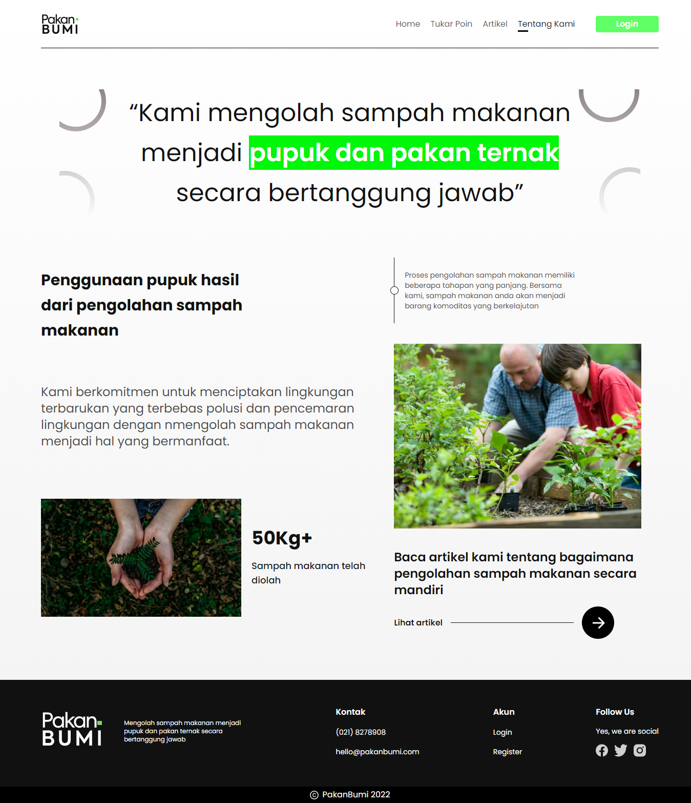

# 🥗 PakanBumi 🥗

Generasi GIGIH 2.0 Capstone Project by FE-WA 4.

1. Vania Elvina Afiati (KM_G2FE1145)
2. Nur Intan Sari (KM_G2FE3117)
3. Ranu Dwi Wahyudy (KM_G2FE5077)
4. Defa Maulana Firmansyah (KM_G2FE4070)
5. Muhammad Raviq (P_G2FE2022)


PakanBumi is a website that provides a food waste pick-up service where customers can earn points that can be exchanged for vouchers or digital money.

## Live Demo

[Click here for demo](https://fe-wa4-pakan-bumi.vercel.app)

## Features

- Login and Registration
- Profile
- Pemesanan Jemput Sampah Makanan
- Tukar Poin
- Artikel Edukasi

## Tech/Framework Used

- ReactJS
- Tailwind CSS
- Typescript
- Figma

## Installation and Setup Instructions

Clone repo

```
git clone https://github.com/ranuwahyudy/pakan-bumi.git
```

Install depedencies

```
npm install
```

Start development environment

```
npm start
```

To build production files and start production server

```
npm run build
```

## Screenshots



